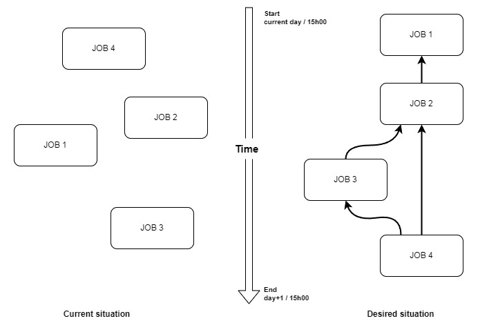

# Dependencies plugin for Rundeck

This plugin add precise control options to Rundeck job's interaction and allow to link jobs together  
in a global workflow, or to other ressources.

[Changelog](CHANGELOG.md)

## Managing a flow (or batch processing)

These plugins came from having worked before with complex flow processing on other schedulers, which were  
providing many tools, not all present in Rundeck.  

It can be reduced to this situation :

To obtain the desired state, the dependency plugin is able to create logical links between jobs,  
restraining them to wait for other jobs, with some fine-tuning options.  

In addition, it also manage an internal workflow definition, which will start the current day (d+0) at 15h00, and end the next day (d+1), same time.  
This ensure any logical link will automatically be restricted inside this time flow boundary.  
And handling correcty the switch to the next day, allowing workflows with a longer duration.  

# Available modules

The following modules have the built-in time limit to be integrated in the daily global workflow :

* [dependencies-wait_job](doc/module_wait_job.md)  
  This plugin allows a job to wait for another job until its completion with a specific status (success, error). Or multiple jobs when used with sequential steps.  

* [dependencies-wait_file](doc/module_wait_file.md)  
  This plugin allows a job to wait for the presence of a file and validate its integrity.  

* [dependencies-wait_slot](doc/module_wait_slot.md)  
  This plugin allows to limit the number of executions running simultaneously to a specific number in a slot.  

All modules : [common usage documentation](doc/module_common_usage.md)  

# Installation & upgrade

## System requirements

Rundeck **5.0** minimum.  
The plugin has been tested with OpenJDK 11 and 17.  
As the code is in Groovy, the plugin should work as-is with more recent Java versions.

_Please note it is possible this plugin could work on Rundeck 4.x, but is has not been fully validated. For such case, use instead the 1.x version of this plugin._

The `quartz.threadPool.threadCount` property in the `rundeck-config.properties` must be set.  
> A surprising situation can occurs, when only 10 executions are running and stuck, and the other executions are missing.  
> This is due to the default limit of 10 simultaneous executions in Rundeck.  
> It will prevent the other executions to launch, and combined with the dependency modules, a deadlock can occur.  
> 
> To prevent this situation, the threadCount property should be defined and set at least to 50, or more if required.  
> The other executions will be launched as soon as one is finished.  
> Restart Rundeck to apply the new value. Please note this will also increase Rundeck's memory consumption.  
> [More information on Rundeck documentation's website](https://docs.rundeck.com/docs/administration/maintenance/tuning-rundeck.html#quartz-job-threadcount).  

## Installation

You can use the Rundeck UI under the system menu (the cog icon, upper right) => plugins => upload plugin.  
In "upload plugin", just drag and drop the jar file on the text area right of `choose a file`,  
then validate, and it will be ready to run.

An alternate way is to place the Dependencies jar in the `/var/rundeck/lib/rundeck/libext/` directory,  
then restart Rundeck.  
Either the file itself, or a symlink to the jar file elsewhere.  
Remove the previous version while on it.  

## Upgrade

When upgrading, the previous Dependencies plugin version must be removed.  
It can be managed under the system settings, plugin section => Installed plugins.  
Search for "depend", removing one of the Dependencies modules will remove the plugin as a whole.  

Notice : it is not recommended to remove or update to a new version while existing jobs are still running.

If you were using the Dependencies plugin v1.x before, there are also additional steps described  
[in the dedicated page](doc/Migration_v1x.md).

# Licence  

[Apache 2.0](LICENSE)
