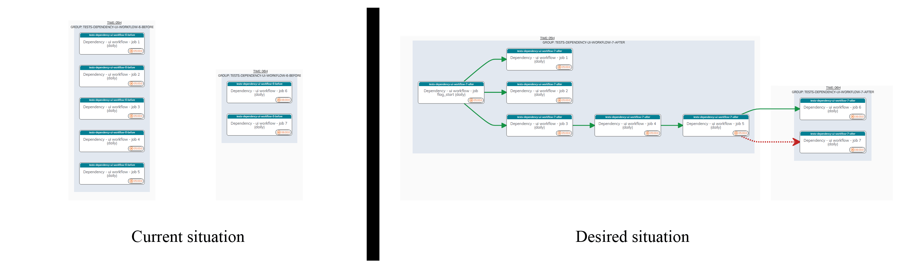
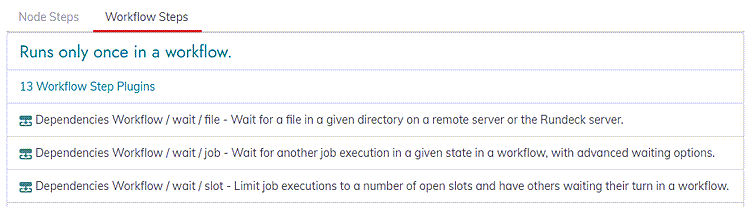

# Dependencies plugin for Rundeck

This plugin provides to [Rundeck](https://www.rundeck.com/) the possibility to link and chain multiple jobs together or to other ressources,  
with precise control options, and to visualize the resulting workflow.

**New version : a new workflow UI plugin for an interactive diagram**

[Changelog](CHANGELOG.md) • [Module documentation](#available-modules) • [Installation](#installation)

## Managing a flow (or batch workflow)

These plugins came from having worked before with complex flow processing on other schedulers, which were  
providing many tools, not all present in Rundeck.  

It can be reduced to this situation :

*Excerpt of the interactive diagram generated by the workflow UI visualization module*

To obtain the desired state, the dependency plugin provide modules able to create logical links between jobs, restraining them to wait for others, with some fine-tuning options.  

In addition, it also manage an internal workflow definition, which will start the current day (d+0) at 15h00, and end the next day (d+1), same time.  
This ensure any dependency link will be attached to the correct job exection inside this boundary.  
And handling correctly the change to the next day in the middle of a workflow, allowing them to run over the full time range.  

# Available modules

## User interface

* [dependencies-wait_workflow_ui](doc/module_wait_workflow_ui.md)  
  This plugin is a UI module allowing to visualize in Rundeck web UI an interactive representation of all the jobs from the current project.  
  A large amount of information is presented in the diagram without requiring to use the other dependencies plugins.  

## Workflow step

The following modules have the daily control of the  global workflow :

* [dependencies-wait_job](doc/module_wait_job.md)  
  This plugin allows a job to wait for another job until its completion with a specific status (success, error). Or multiple jobs when used with sequential steps.  

* [dependencies-wait_file](doc/module_wait_file.md)  
  This plugin allows a job to wait for the presence of a file and validate its integrity.  

* [dependencies-wait_slot](doc/module_wait_slot.md)  
  This plugin allows to limit the number of executions running simultaneously to a specific number in a slot.  

All workflow modules : [common usage documentation](doc/module_common_usage.md)  

# Installation & upgrade

## System requirements

Rundeck **5.0** minimum.  
The plugin has been tested with OpenJDK 11 and 17.  
As the code uses Groovy, the plugin should work with more recent Java versions without much trouble.

_Please note it is possible this plugin could work on Rundeck 4.x, but is has not been fully validated. For such case, use instead the 1.x version of this plugin._

> [!WARNING]
> **The `quartz.threadPool.threadCount` property in the `rundeck-config.properties` must be set.**  
>
> A surprising situation can occurs, when only 10 running executions are in fact stuck, and the other executions are missing.  
> This is due to the default limit of 10 simultaneous executions in Rundeck.  
> It will prevent other executions to launch, and combined with the dependency modules, will cause a deadlock.  
> 
> To prevent this situation, the threadCount property should be defined and set at least to 50, or more if required.  
> The other executions will be launched as soon as one is finished.  
> Restart Rundeck to apply the new value. Please note this will also increase Rundeck's memory consumption.  
> [More information on Rundeck documentation's website](https://docs.rundeck.com/docs/administration/maintenance/tuning-rundeck.html#quartz-job-threadcount).  

## Installation

You can use the Rundeck UI under the system menu (the cog icon, upper right) => plugins => upload plugin.  
In "upload plugin", just drag and drop the jar file on the text area right of `choose a file`,  
then validate, and it will be ready to run.

An alternate way is to place the Dependencies jar in the `/var/rundeck/lib/rundeck/libext/` directory,  
then restart Rundeck.  
Either the file itself, or a symlink to the jar file located elsewhere.  
Remove the previous version while on it.  

## Upgrade

When upgrading, the previous Dependencies plugin version must be removed.  
It can be managed under the system settings, plugin section => Installed plugins.  
Search for "depend", then removing one of the Dependencies modules will remove the plugin as a whole.  

Notice : it is not recommended to remove or update to a new version while existing jobs are still running.

If you are using the Dependencies plugin v1.x and upgrading to v2+, there are also additional steps described  
[in the dedicated page](doc/Migration_v1x.md).

# Licence  
[Apache 2.0](LICENSE)  

The plugin icon is from the Fontawesome v6 (Free) package.
