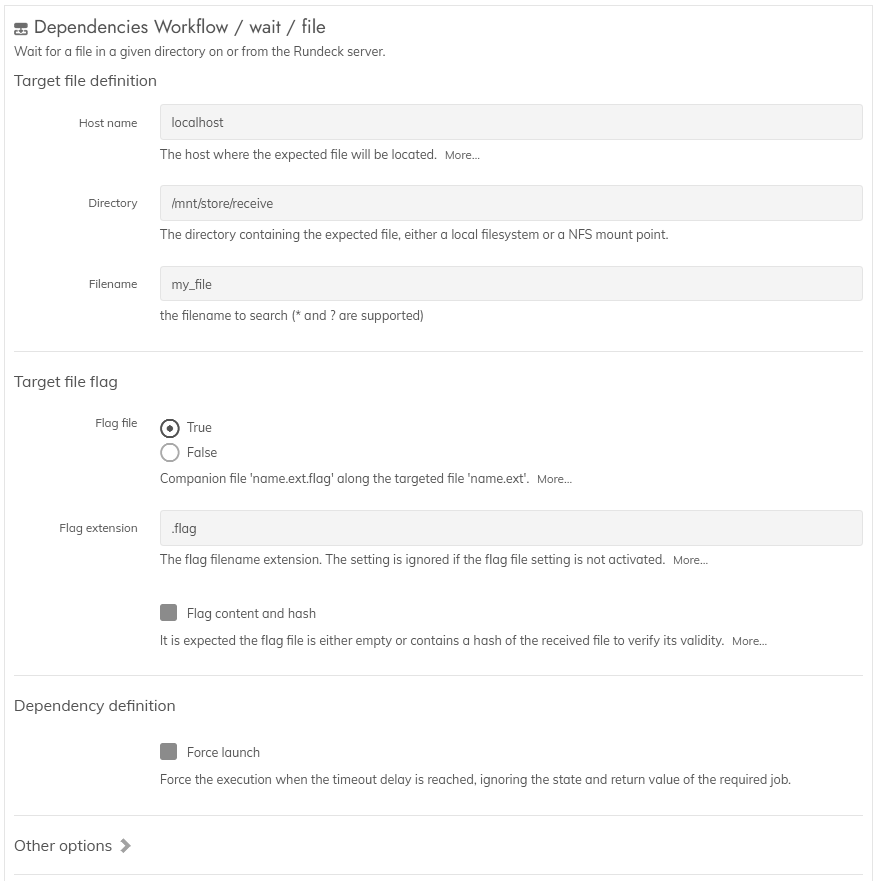

**Rundeck plugin : dependencies**

# Module usage

## Module: Wait for / File  

This module is a workflow step, executed globally.  
It will handle a dependency - or link - to the presence of a file, waiting until the  file exists on the system.  
The additional presence of a flag or marker for signaling the completion of the transfer is supported.

Having this module designed as a workflow step allows to handle some special cases.  
For more standard situations requiring a node step, it exists other plugins for Rundeck more suited for this usage.  

Notice : this module can only works on Linux systems, or anything supporting at least the shell commands `ssh` and `find` (from the `findutils` package).  
The `coreutils` package is also required on the target system, if the checksum validation is used.

### Step settings
------

The documentation is integrated into the plugin.  

### Available modes
------

* standard : just check for the file presence

* flag : if used, an additional file will be searched, reusing the requested filename and a suffix.  
  This is to alleviate file sending utilities unable to use a temporary file, and directly sending the data
  under the final file name.  
  Without this, a step could be already working on a partial file due to a transfer not yet completed.  
  In addition, if the flag is not an empty file and contains a hash, a validation will be done  
  to validate the given hash with the received file.  

While the job is initialy created for searching for a single file, it is possible to wait for multiple files,  
as long as a flag file is created last, after all of the other files are fully sent.  
Also, if the files are always sent in the same order, in this case targeting the last file will also work.  

### Supported hash methods
------

The following hashes are supported : crc, md5, sha1, sha224, sha256, sha384, sha512.  

Please note the flag file's content must be using the format supported by the system commands, like sha256sum.  
The Dependencies module does not do a checksum validation by itself.

### Sleep duration
------

This module can uses 2 differents time between each file presence check :  
* for a local verification, the usual sleep time is used, with a default value set to 30 secs.
* for a remote verification, the longer sleep time is used, which is 180 secs.

Both values can be changed globally, see the "common usage" section in the documentation.
