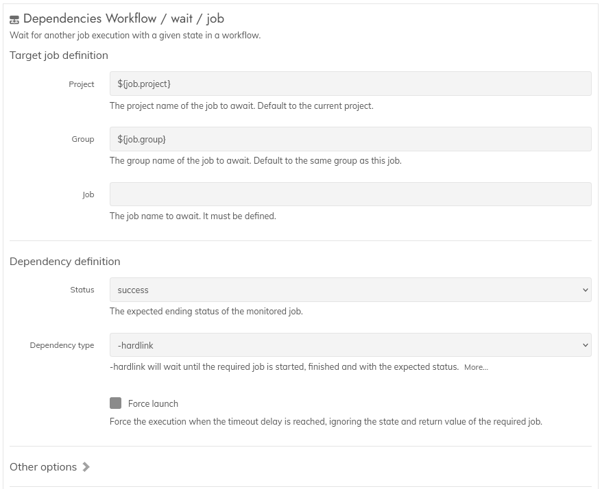

**Rundeck plugin : dependencies**

# Module usage

## Module: Wait for / Job  

This module is a workflow step, executed globally.  
It will handle a dependency - or link - to another job, waiting until its execution is complete with a specific status.  
Or multiple dependencies if the module is reused in sequential steps.

Notice : the Rundeck's property `quartz.threadPool.threadCount` must be set at a higher value. Check the dedicated page for the common usage.  

### Step settings
------

The documentation is integrated into the plugin.  

### Available modes
------

* blocking mode : when `dep type = hardlink`, wait for a target job until it is finished.  
  Even if started much later, or if the end of the internal flow is reached.  
  This mode allows to launch multiples jobs at the same time, with the order handled  
  by the dependencies themselves.  

* non-blocking mode : when `dep type = softlink` the module will wait only if the target job  
  has been launched before in the current flow.  
  It can be running or already finished with the wrong status, the link will be activated.  
  Otherwise, when the target is absent, it will skip the dependency step without error.  
  Commonly used with conditional jobs that aren't always executed.  
  For example, weekly or monthly jobs.  
  In such case, the target job must be started at least one minute before.  

The non-blocking mode might require adding another step using also the Dependencies Job module, but in  
blocking mode to a different job.  
It will ensure the global sequence is respected.  
It is related to the immediate completion of this step if the targteted job was not  
present in the same flow.

In both modes, the module will keep waiting if the target job is present but  
without the required status (success or error)  

Hint: if you have a lot of jobs, a diagram tool might be handy to write down the  
expected order.  

### FAQ and common situations
------

* **The plugin is not able to find the target job or project when launched :**  
  Verify the presence of an extra space somewhere in the name of the job or group, which can be masked by the html rendering of the web browser.  
  Edit the targeted job to do a copy from the group and name area in the editor panel, and paste them in the "wait for/job" step.  

* **It is not possible to use job ID instead of the name :**  
  This restriction is by design, as an ID has little meaning when you start having 20+ jobs linked together.  
  While it is true Rundeck allows to easily change a job name, this is something rare after some times when the workflow is stabilized.  
  On the other hand, IDs might change when importing a job.  
  
* **Only a handfull of jobs are present at the workflow starting time, and other executions are missing :**  
  Check the `threadCount` setting in the "System requirements" from the installation section of this plugin.  
  It is caused by the number of simultaneous executions managed by Rundeck.  

* **It is sometimes necessary to manually launch a job in the afternoon, causing an interference with the nightly workflow dependencies :**  
  This is a Rundeck limitation, as to support this situation, the executions should be split in 2 distinct objects, an execution log, and an execution event.  
  To alleviate such situation, the following options are available :  
    * delete the interfering execution when finished, after saving the log externaly. This will remove all traces of the execution for Rundeck.
    * change the start/end time of the daily flow to be closer to the real time the daily workflow starts. The manual launch will be seen as related to the previous workflow. See the "All modules: common usage" section.
    * for the jobs linked to those manually launched, add another dependency to a job starting only when the workflow does. See the flag explaination right after.

* **Using a soft dependency to link daily with monthly job does not always work :**  
  It might be related to the time the jobs are started : to work correctly, the target of a soft dependency must be already running.  
  Also, this module has a short waiting time at start for allowing the executions to settle before the dependencies are checked.  
  Given those requirements, the target job must be launched at the same time, or before (1 min is enough) the step with the soft dependency is executed.  
  Make also sure the threadCount parameter has been increased.

* **There are a lot of jobs to link together, making them difficult to maintain :**  
  Rearrange the jobs in smaller groups, encapsulated by empty jobs called flag jobs.  
  Their only purpose is to serve as the starting and ending point of a group for the dependencies.  
  In a given group, have all of your jobs linked to their own predecessor, but also to the starting flag job of the group.  
  The ending flag job should be linked to all the jobs of the group, or at least to the most important of them. And the starting flag job, too.  
  Then, to link a group to another, add a dependency from the starting flag job to the ending flag of the other group.  
  This way, each job in a group will have mostly 2-3 dependencies to manage.  

* **Multiple jobs need a timeout much shorted due to business requirements, but not all of them, so the global dependency timeout is not an option :**  
  This is not uncommon, as a workflow can have external requirements that might not alway be present on time.  
  The solution is to either activating the job timeout option, or using the `--maxWait` parameter on the dependency step for those jobs (And keeping track of which job or step has such setting active).  
  An alternate option is to move the timeout to a flag job, related to the group waiting for the requirements.  
  It can be either the `--maxWait` parameter or the job timeout itself.  
  Only the flag job will end in timeout, signaling a problem has occured, while the jobs linked to the external requirements will keep waiting.  
  At this point, they can be either surgically halted to unlock the dependencies, completely bypassed, or fixing the problem upstream and restarting the flag job.  
  The downside would cause having many jobs in the "running" state. Discerning them will stand on a correct naming of the jobs.  

* **There are too many jobs to follow :**  
  Another plugin could alleviate this, but this requires a much more intricate knowledge of Rundeck's internals, and some javascript too.  
  This is planned, but will require time. Meanwhile, a free diagram application, like Draw.io, can help as a substitute.  
  After having written down the workflow's and job's informations, you can use the export to image (png) option, providing a sufficient help when having to manipulate the workflow.
