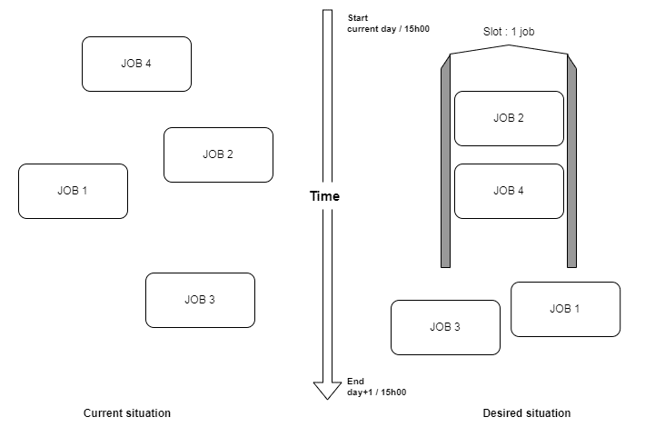
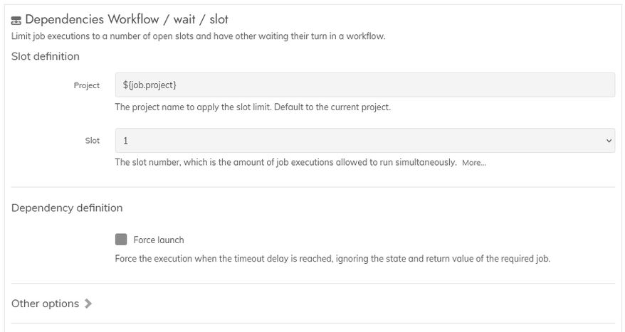

**Rundeck plugin : dependencies**

# Module usage

## Module: Wait for / Slot  

This module is a workflow step, executed globally.  
It will handle a dependency - or link - to a numbered slot, specifying the number of jobs allowed to execute simultaneously.  
When the limit of a slot is reached, all other jobs related to the same slot will wait, until a job is finished and free a place in the slot.  

For example :  having the jobs "a", "b", "c" and "d" linked to the slot number `2`, only "a" and "b" will proceed.  
The jobs "c" and "d" will wait, and one of them will proceed only when "a" or "b" is ended.  
As the module uses the executions as a reference, launching a new instance of an allowed job will have to wait like the other executions.

Another example with the slot number "1", allowing only 1 job after the other :  

Please note this mechanic applies on groups of jobs, it is not related to the `Multiple Executions` setting specific to a single job. 

### Step settings
------

The documentation is integrated into the plugin.  
An existing project name must be specified. Targeting all the projects with a wildcard is currently not supported.

### Available slots
------

Currently 5 slots are available, each of them being the number of simultaneous jobs allowed to execute.  
Each slot limit is per project : the 3rd slot will have 3 spots for a given project, and 3 other spots for each other project.  
The slots have no knowledge of the other dependency modules, thus a single slot can cover a whole workflow.  

If there is a need to have a slot reset to its full capacity, just separate the jobs in groups and add a dependency job step between the 2 groups.  
As long as all the jobs linked to a slot are finished, even if failed, the next jobs will be able to access the same slot, fully empty.  

**Special case**  
Having a step configured with a reduced "maximum waiting time" (i.e. : 1 hour), and "forced execution" is also activated.  
In such situation, the execution will override the slot limit when the timeout occurs, and still register itself in the slot.  
This can give a higher priority to some jobs as the other with a longer waiting time will still wait.  
But it can also cause problems if the slot limit must always be followed.

### Usage with other dependency modules
------

While the modules can be used multiples times together in the same job, the main restriction is being able to work only from an already running job.  
Given the wait-for/slot module checks the "running" state when activated, having it placed before another dependency step might create a deadlock situation.  
It is suggested to have the wait-for/slot step as the last dependency step in a job, right before its workload steps.  

As such, it is also not suitable for a job to have more than a single "wait for / slot" step.  
