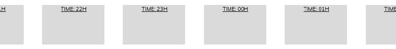
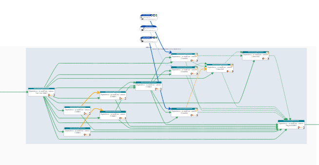
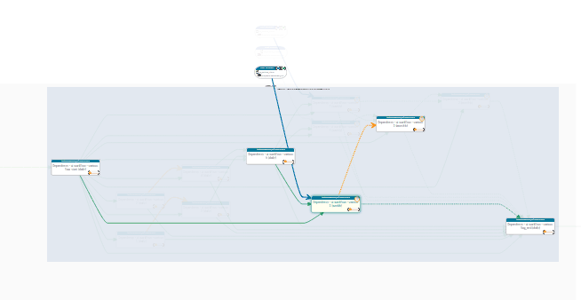
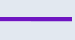
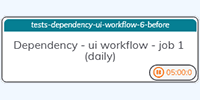
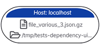

**Rundeck plugin : dependencies**

# Module usage

## Module: Wait for / Workflow UI

This module is a UI module, accessible from Rundeck interface, on the jobs section of a project.  
A new button will be available on the upper right, named "Dependencies" :  


It uses the current project data to generate a diagram representation of all the jobs in the project.  
The diagram is interactive with a lot of information as tooltips, can be moved freely, and also supports zooming.

To prevent an unwanted calculation, the diagram will be loaded only after the refresh button is pressed on the diagram panel.

> [!IMPORTANT]
> **Beta release**  
> While fully fonctional, the module is still regarded as beta.  
> Some elements are incomplete if not missing, or might be subject to important changes.  
>
> The following updates are planned for future releases :
> * exporting the diagram as a png.
> * create a temporary copy of the diagram to allow browsing other pages without the need of a full recalculation.
> * a minimap.
> * print the timeout delay and other informations as labels on the dependencies links.
> * a control panel with real-time options : 
>   - per-user configuration.
>   - make visible all the schedule zones, even when empty.
>   - create schedule zones per 15 mins instead of hourly.
> * support the rendering of other plugin steps and commands in the diagram.
> * tighten the size of the clusters / zones sometimes too large.
> * gracefull handling of errors, which is currently almost no-existent.


## Requirements and limitations

Given the need to access all existing jobs properties, the module will appear only for administrator accounts.  
Keep in mind that having to request all job's informations will cause an important load on Rundeck through its API for some seconds.  
The time to render the diagram is also proportionnal to the number of jobs. Even if the plugin is fast, it can easily take from 5 to 10 seconds.

For now, having the calculated output saved within the browser is not implemented yet.
As such, it is recommended to keep the generated diagram in a dedicated tab or window as long as needed.

Please note each time the diagram is generated, some elements can be slightly altered between 2 refreshes.
This is expected, due to the mathematical calculations.  
The expected behavior are expected : 
* Some elements can be reordered differently, while still respecting their constraints.  
  For example, 2 jobs at the same level can be inverted in their vertical order.
* The diagram will have a tendency to stack nodes in columns when they are deemed similar.  
  No parameter is available to limit this behavior, some column can be really long.
* The clusters for the hourly schedules might be larger than their content.
* The placement of the boxes for the houly schedules can be off or misaligned
  Most extreme cases are often due to conflicting hours/minutes in the schedules. 

On a notable note, time isn't much of a requirement for the dependencies plugins to work in the same workflow.  
While it can be common to have all the jobs of a full workflow scheduled to start at the same hour,  
it is not necessary as multiple jobs will not be able to start before a given time anyway, due to the duration of their predecessors.  


## General presentation and usage

All jobs are placed in hourly zones, or clusters, related to their schedules, then assembled by their group names.  



The hourly schedules are ordered as follow : 
```
   Manual     => incremental schedule  => 15h  => 16h  => ... 00h  => 01h  => ... 14h
(no schedule)     (ex: * or */2)
```
The starting hour at 15h00 to the next day 14h00 is the same sequence used by the other dependencies plugins for the daily workflow.

Empty schedules zones will be hidden to limit the burden and complexity of the diagram.


### Pan, zoom and focus

The diagram can be moved by clicking and holding on an empty area.

The zoom is supported, for now only when using the mouse wheel from anywhere.  

Is is possible to have the diagram much clearer by activating the focus on a job and its dependencies : just click on the title / header with the group name, from a job node.  
This will highlight the selected job, and keep the dependencies attached to the selection, with their related nodes.  
Everything else will be masked out.  

Example :  

| Normal view | With focus |
| - | - |
|  |  |


Click again on the same node title / header to remove the focus, or on another node title/header to move the focus.
 
 
### Tooltips

Most of items in the diagram have an integrated tooltip :  
- all icons appearing over any job or file nodes have a description of their purpose, if not their configuration.  
- all links between job nodes have a tooltip located at the footer of the diagram, describing their behavior.

They are also described in the following nodes section.  


---
## Links and nodes objects

### Links

| Arrow | Information | | Arrow | Information |
| - | - | - | - | - |
|  | Standard dependency, also named hardlink,<br /> waiting until the success state is reached ||  | Soft dependency, activated only if the target job is already present, <br />in a running or finished state (success or error) |
|  | Forced dependency, which will be skipped when a specific duration is reached ||  | Dependency or link to a job with an error status |
| |
|  | Dependency to a file, can also be forced |
|  | A job launched by the "job reference" module used in a step or with an error handler  |


---
### Nodes

| Visual | Type | Description |
| - | - | - |
|  | Job node | This node represent a Job in Rundeck, and will have the following elements depending of its definition : <br />* the name of the job's group as the title/header. Clicking on it will activate the focus selection on this job, or move it if already active.<br/>* the job's name, which is also a link for opening in a new window the job definition.<br/>* the schedule for the job in a short format, the full definition being available as a tooltip when hovering over.<br/>* in some cases, the project will also be present, when the referenced job is in another project, or when its definition does not exist in the current project. |
| |
|  | File node | This node is generated by the definition from a dependency-wait_file step.<br />It will present the host, directory and file targeted in the definition.  <br />They can be truncated due to their length, but are fully complete in their tooltip.|


**Possible markers**  
Some other icons can appear on a node depending of its configuration.

| Marker | Type of node | Information |
| - | - | - |
|  | Job | One of the steps use the slot module. The visible number is changed to the selected slot(s), and can show multiple of them if necessary. |
|  | Job |  One or multiple notifications is activated on the job. Only those activated are present in the marker.<br/>The abbreviations stand for : **St**art, **Su**ccess, **Fa**ilure, **Av**erage duration |
|  | Job |  Visible on a dummy node, reflecting a job launched by the step module "Job reference". |
|  | Job |  Visible on a job which has its execution fully disabled. The node for the job is also greyed out.  |
|  | Job |  Visible on an unknown job, when its definition for the current project was not found. <br />Usually an anomaly in the dependency configuration of the step, like an extra space in the name. |
| |
|  | File | When the presence of a flag file is activated in the definition, a small flag will be present as a marker.<br />Also, if a hash control value is expected and active, the green hash will also be visible. |


## Diagram librairies used

For the curious :  
* Diagram layout : [DagreJS](https://github.com/dagrejs) v3.0.0 (graphlib v4 is integrated)
* Diagram rendering : [Dagre-3d](https://github.com/dagrejs) v0.6.4
  modified to support Dagre v3 (integrated) & D3js v7 (external)
* Diagram vizualization : [D3js](https://d3js.org/) v7.9.0

While DagreJs is extremely powerfull for the automatic placement of the nodes, it is also very limited, if not lacking, when asking for more precision.  
Giving a specific order to the hourly schedule boxes and keeping them aligned didn't come easily.
